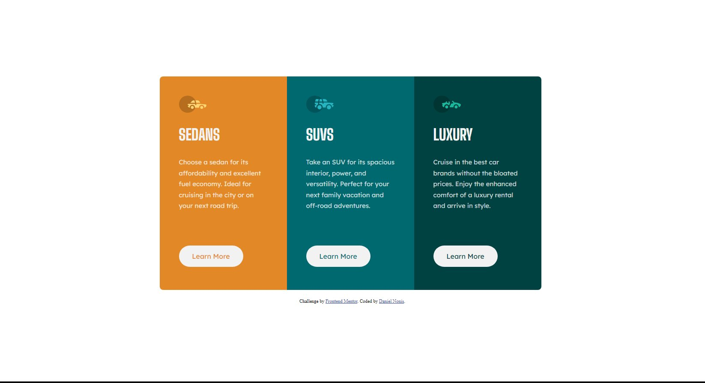

# Frontend Mentor - 3-column preview card component solution

This is a solution to the [3-column preview card component challenge on Frontend Mentor](https://www.frontendmentor.io/challenges/3column-preview-card-component-pH92eAR2-). Frontend Mentor challenges help you improve your coding skills by building realistic projects. 

## Table of contents

- [Overview](#overview)
  - [The challenge](#the-challenge)
  - [Screenshot](#screenshot)

- [My process](#my-process)
  - [Built with](#built-with)
  - [What I learned](#what-i-learned)
  - [Continued development](#continued-development)

- [Author](#author)


**Note: Delete this note and update the table of contents based on what sections you keep.**

## Overview

### The challenge

Users should be able to:

- View the optimal layout depending on their device's screen size
- See hover states for interactive elements

### Screenshot




### Links


## My process

I'm pretty proud of this one as it only really took me like 2 hours to complete. I started giving the HTML the proper semantic tags and adding an `````` for each type of car as well as a button. Then I made 3 ```<div>``` and gave each the proper background color and styling all the text. The hardest thing was surprisingly the button, as I just couldn't figure out how to make the text of the ```<button>``` the same as the backround color of the ```<div>```, not of the button itself. So I just gave up and did each button individually instead (which I feel is definitely wrong)
  
### Built with

- Semantic HTML5 markup
- CSS custom properties
- Flexbox

### Continued development

Something that I struggle with is when there is a consistent gap between elements and the the last one (in this challenge's case the button) is sent to the button. I can sort of do the same as the image but I feel like it's not a proper way to do it.
Also I'd like to learn how to automatically give the text element of the button the background color of the div the button is in, not the button itself, as I decided to just do button by button, definitely breaking the DRY method.


## Author

- Frontend Mentor - [@Xarxytarsan](https://www.frontendmentor.io/profile/Xarxytarsan)


